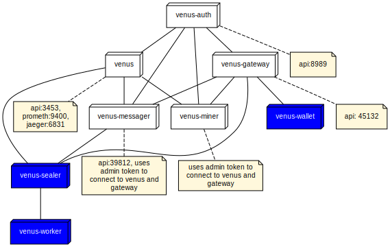

# cupid

<p align="center">

</p>

 <br/><br/>
### Venus service cluster deployment with kubernetes/helm charts (Under Development)
 <br/><br/>
<p align="center">

</p>
 <br/><br/>

## Prerequisites:

- kubernetes (v 1.22 or above) cluster with nodes suitable for running venus(requires > 2TiB of storage) and other modules

- Helm v3
## Repo organization:
- cupid/cupid repo is an umbrella helm chart that contains a separate subchart for each venus module. For example cupid/cupid/charts/venus contains help sub chart for installing venus module.
- The docker files for various venus submodules are located in subfolders with names corresponding to the git repo names i.e. cupid/venus, cupid/venus-auth etc.. Modify the git repo checkout command in the Docker file to the required release tag of the module.
- helm charts are located in the cupid/charts folder as subcharts. Currently the charts refer to Docker hub repo "zeethio". You may to change to your own repo.
- cupid/storage folder contains PersistentVolume allocated for venus as local disc folder and for venus-auth as nfs mount.
- cupid/secrets contain template for specifying shared-admin token 
- There is some skeletal documentation for each module in the subfolders along with Dockerfile. These docs are created to gain insight into the communication across modules. For accurate interpretation of API calls refer to Venus official documentation and source code.
## Deployment Notes:
- Currently the venus modules are deployed as StatefulSets and exposed through NodePort service. In future it will be changed to Deployments exposed through clusterIP and load balancing for scalability and reliability.

### Preparation
- Identify cluster node for venus, allocate local disk folder. Create nfs mount for venus-auth. Create the peristant volumes before running helm charts

```
kubectl create -f storage/pv-cupid-venus-1.yaml
kubectl create -f pv-cupid-auth.yaml
```
Install Helm chart for venus-auth service
```
helm install cupid-auth cupid/charts/auth
```

Generate shared admin token

```
kubectl exec --tty --stdin auth-0  -- /app/venus-auth/venus-auth --repo /data/repo token gen cupid --perm admin
```
Copy the teplate file secrets/shared-token-template.yaml to a file, for example shared-token.yaml. Update the adminToken in this file with the value generate from the above command.

Deploy the secrets
```
kubectl create -f shared-token.yaml
```

Setup the global variable that defines service endpoints.
```
kubectl create -f globals/config-map.yaml
```

Install Helm charts for venus node service.
The chart value is by default start from a snaphot of filecoin blockchain. This will accelerate syncing of the node. The vsnapshot value can be from mounted local disc volume of venus pod or from url. setting it null starts from the previous state.
Set the value in cupid/charts/venus/values.yaml
arguments:
  snapshot: /data/minimal_finality_stateroots_latest.car

```
helm install cupid-venus cupid/charts/venus
```

Install Helm charts for all the venus services
```
helm install cupid-venus cupid/charts/venus
helm install cupid-gateway cupid/charts/gateway
helm install cupid-messager cupid/charts/messager
helm install cupid-miner cupid/charts/miner
```
